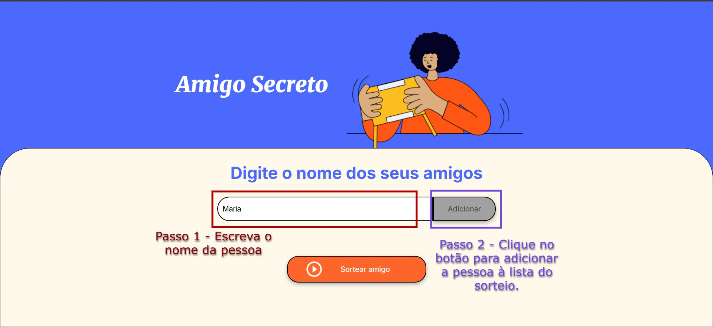
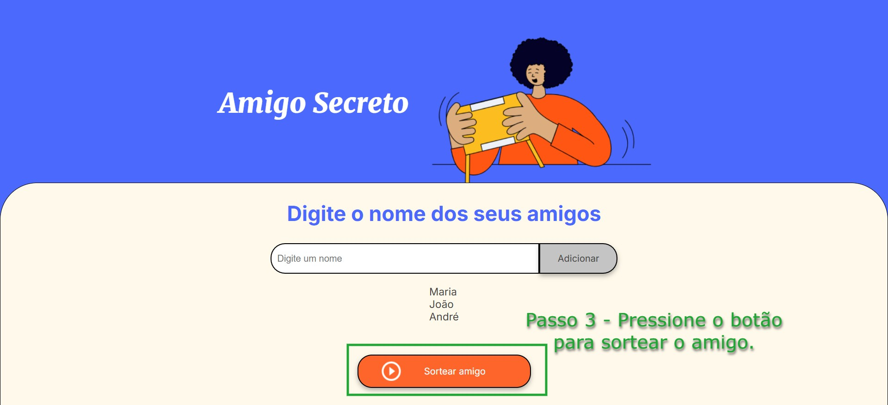
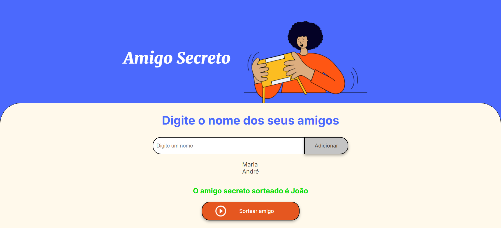

# Desafio Amigo Secreto

## Sobre o Repositório
Este repositório contém a solução para um desafio de programação proposto pela **Oracle Next Education**. O desafio consiste em criar funções em **JavaScript** para executar as operações de back-end de uma página destinada ao sorteio de um **Amigo Secreto**.

A estrutura do repositório é a seguinte:
- **Pasta `main`**:
  - **`script.js`**: Arquivo contendo todas as funções exigidas no desafio.
  - **`style.css`**: Arquivo de estilização da página.
  - **`index.html`**: Arquivo principal que pode ser aberto em qualquer navegador com suporte.
  - **Pasta `assets`**: Contém imagens utilizadas no HTML.
- **Pasta `imagensp_readme`**: Contém imagens utilizadas na explicação deste README.

## Como Utilizar o Programa
Siga os passos abaixo para utilizar o programa:

### 1. Abrir a Página
Navegue até a pasta `main` e abra o arquivo **`index.html`** no navegador de sua preferência. Isso abrirá a página web do programa.

### 2. Adicionar Amigos à Lista
Ao abrir a página, você encontrará um campo onde poderá adicionar os nomes de seus amigos. O processo é descrito abaixo:

1. Digite o nome de um amigo no campo fornecido, conforme o passo 1 .
2. Clique no botão **"Adicionar"** para incluir o nome na lista, como indica o passo 2.
3. Repita os passos anteriores para cada amigo que desejar adicionar.

### 3. Realizar o Sorteio
Depois de adicionar todos os nomes, você está pronto para realizar o sorteio. Basta clicar no botão **"Sortear"**. Cada sorteio irá:

- Exibir o nome do amigo sorteado na tela.
- Remover o amigo sorteado da lista.

O amigo sorteado será exibido na tela, assim como mostra o exemplo abaixo:

- Repita esse processo até que todos sejam sorteados.